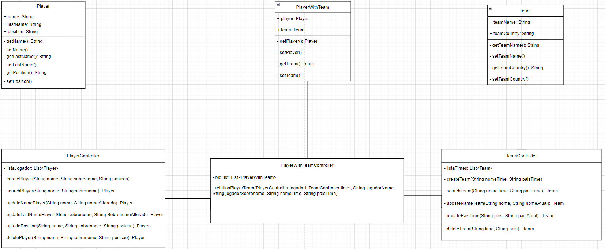
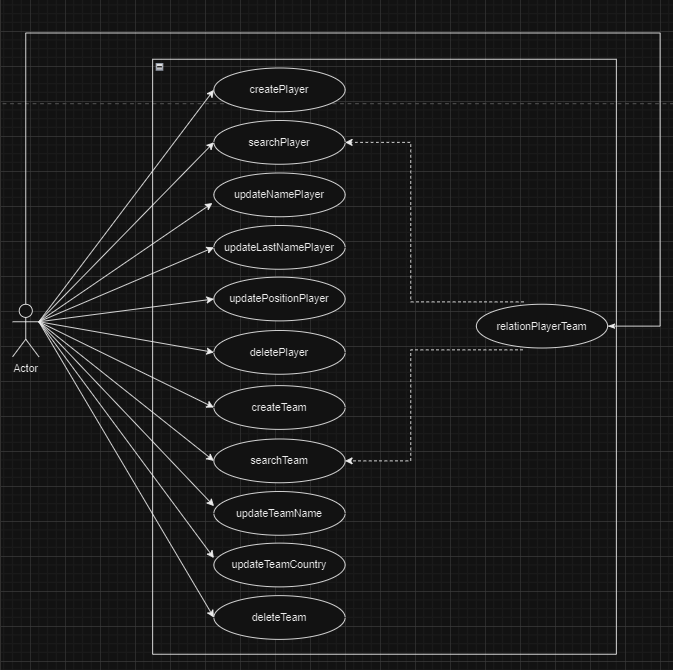

## Repositório dedicado à materia de Engenharia de Software do 2º e 3º semestre do curso de Banco de Dados da FATEC - São José dos Campos.

- 1ª atividade - Comentários do livro SWE at Google;
- 2ª atividade - Três exemplos de tradeoffs;
- 3ª atividade - Análise dos requisitos não funcionais e tradeoffs das arquiteturas dos slides 24 à 29; 
- 4ª atividade - Definição de arquitetura;
- 5ª atividade - Classes UML;
- 6ª atividade - Código JAVA;
- 7ª atividade - Testes;
- 8ª atividade - Modelo de Caso de Uso.

## Atividade 1 - Comentários do livro SWE at Google

Withain Google, we sometimes say, “Software engineering is programming integrated over time.” Programming is certainly a significant part of software : engineering after all, programming is how you generate new software in the first place. If you accept this distinction, it also becomesnsion to programming. Cubes clear that we might need to delineate between programming tasks (development) and software engineering tasks (development, modification, mmimaintenance). The addition of time adds an important new dimeension to programming.

We see three critical differences between programming and software engineering: time, scale, and the trade-offs at play. On a software engineering project, engineers need to be more concerned with the passage of time and the eventual need for change. In a software engineering organization, we need to be more concerned about scale and efficiency, both for the software we produce as well as for the organization that is producing it. Finally, as software engineers, we are asked to make more complex decisions with higher-stakes outcomes, often based on imprecise estimates of time and growth.

#### Comentários

- Programação é a parte mais importante da engenharia de software e é como a aplicação será desenvolvida. Porém, o que faz a engenharia de software ser diferente de programação são três pontos cruciais: tempo, escala e tradeoff.
- Tempo: Como tudo na vida, as coisas evoluem e isso não é diferente com as tecnologias. Se um código não tem manutenção, o tempo vai fazendo com que o software fique ultrapassado, tendo como consequência sua inutilização.
- Escala: Possibilidade de expandir o software, otimizar.
- Tradeoff - Avaliar os pontos negativos e positivos, pore na balança e identificar o que é o melhor para o projeto.

## Atividade 2 - Três exemplos de tradeoffs

1º Utilizar python para ganhar velocidade no desenvolvimento do software em relação ao JAVA, tendo em vista que a tecnologia possui uma sintaxe simples com alta curva de aprendizado. Porém, perder na portabilidade do sistema, já que JAVA pode ser executado em qualquer dispositivo que possua JVM (Java virtual machine);

2º Utilizar MongoDB para facilitar a parte de código para armazenamento de dados em relação ao sgbd da Oracle. Porém, tem uma escalabilidade menor que o segundo banco de dados mencionado;

3º Utilizar linux para ter uma segurança maior em relação ao windowns. Porém, tem uma interface menos visual que a do sistema da microsoft. 

## Atividade 3 - Análise dos requisitos não funcionais e tradeoffs das arquiteturas dos slides 24 à 29

####  Arquitetura de Camadas 

Este padrão é amplamente utilizado em desenvolvimento de software para criar sistemas modulares e de fácil manutenção. 

Ela tem uma simplicidade muito grande, o que torna ela mais barata de ser desenvolvida. Porém, por estar tudo no mesmo lugar, faz com que ela tenha uma escalabilidade pequena, o que dificulta o crescimento do sistema.

####  Arquitetura pipeline 

É uma arquitetura utilizada mais em processamento de dados e computação paralela, onde a velocidade do processamento é crucial.

Ela, assim como a arquitetura de camadas, é simples, o que a torna barata. Porém, não escala muito bem por fazer uma atividade de cada vez.

####  Arquitetura microkernel 

Utilizado em sistemas operacionais, onde vc tem o núcleo e os plugins, que são as interfaces. Tem um bom custo beneficio. Mas não possui uma boa escalabilidade.

####  Arquitetura baseada em serviços 

É um modelo de desenvolvimento de software que visa criar sistemas distribuídos e capazes de trabalhar com outros sistemas. Ao contrário da simplicidade das arquiteturas de camadas e pipeline, ela oferece uma abordagem mais escalável e flexível, mas perde em custo, sendo mais caro.

####  Arquitetura Orientada a Eventos 

É um modelo que foca na comunicação entre os componentes do software por meio de eventos, fazendo com que seu desenvolvimento seja mais complexo. Ao contrário das arquiteturas de camadas e pipeline, a arquitetura orientada a eventos permite que os componentes reajam a eventos assíncronos, o que torna maior a flexibilidade e a escalabilidade.

####  Arquitetura de Microsserviços 

É um modelo de software que organiza um sistema como um conjunto de serviços independente e autonomos, cada um focado em realizar uma função em especifico. Essa arquitetura permite que o sistema tenha uma grande escalabilidade, mas por ter serviços indepententes faz com que o projeto seja algo mais complexo e caro.

## Atividade 4 - Definição de Arquitetura para o Sistema

Optei por desenvolver o sistema com a arquitetura em camadas. Por ter uma composição mais simples, faz sentido um pequeno sistema ser projetado em tal formato. Além de facilitar a reutilização de código e futuramente, escalabilidade do sistema.

## Atividade 5 - Classes UML

## Atividade 6/7

Código e teste

## Atividade 8

Modelo de Caso de Uso

